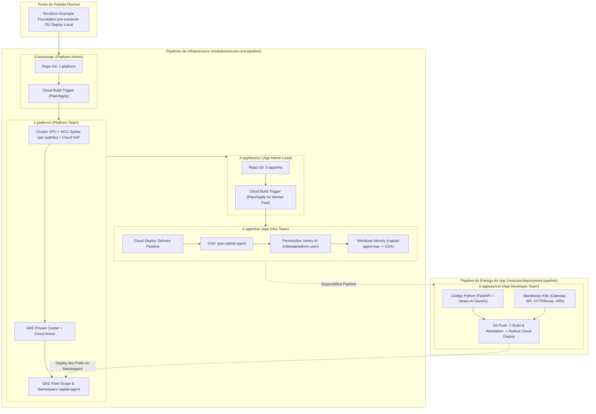

# Capital Agent: Standalone Multi-Project Architecture (EAB)

This example provides a complete, end-to-end multi-project implementation of the **Capital Agent** reference application following the [Enterprise Application Blueprint (EAB)](https://cloud.google.com/architecture/enterprise-application-blueprint/architecture) architecture.

It implements a pure **GitOps** operational model where **all infrastructure is versioned in Git and applied via Cloud Build** using `modules/secure-cicd-pipeline`, and the application code is continuously delivered using `modules/deployment-pipeline`.

---

## Architecture & Lifecycle Overview



---

## Personas & Multi-Stage Execution Model

| Stage | Directory | Persona | Projects | Responsibilities |
| :--- | :--- | :--- | :--- | :--- |
| **0 - Bootstrap** | `0-bootstrap/` | **Platform Admin** | `prj-platform-admin` | - Provisiona a esteira de CI/CD (`modules/secure-cicd-pipeline`) para versionar e aplicar a infraestrutura de plataforma (`1-platform`). |
| **1 - Platform Infra** | `1-platform/` | **Platform Team** | `prj-network-host`<br>`prj-platform-cluster` | - Cluster VPC com **NCC Spoke habilitado por padrão**.<br>- Sub-redes (nodes, pods, services, proxy-only para Gateway API) e Cloud NAT.<br>- Cluster GKE Privado, Cloud Armor, GKE Fleet e namespace `capital-agent`. |
| **4 - App Factory** | `4-appfactory/` | **App Admin Lead** | `prj-app-admin` | - Provisiona o ambiente do tenant (`modules/secure-cicd-pipeline`): Projeto Admin, Artifact Registry, Private Worker Pool e trigger de CI/CD para o `5-appinfra`. |
| **5 - App Infra** | `5-appinfra/` | **App Infra Team** | `prj-app-admin`<br>`prj-app-workload` | - Provisiona a esteira de entrega (`modules/deployment-pipeline`), GSA `gsa-capital-agent`, permissões do Vertex AI (`roles/aiplatform.user`) e **Workload Identity binding**. |
| **6 - App Source** | `../6-appsource/` | **App Dev Team** | Repositório Git do App | - Código Python do Capital Agent (GenAI ADK / Gemini), `Dockerfile`, `skaffold.yaml` e manifestos K8s. |

---

## Step-by-Step Deployment Guide

### Stage 0: Platform CI/CD Pipeline
```bash
cd 0-bootstrap
cp terraform.tfvars.example terraform.tfvars
terraform init && terraform apply
```

### Stage 1: Platform Infrastructure (GitOps or Direct Apply)
```bash
cd ../1-platform
cp terraform.tfvars.example terraform.tfvars
terraform init && terraform apply
```

### Stage 4: App Factory (Tenant Onboarding)
```bash
cd ../4-appfactory
cp terraform.tfvars.example terraform.tfvars
terraform init && terraform apply
```

### Stage 5: App Infrastructure & Delivery Pipeline
```bash
cd ../5-appinfra
cp terraform.tfvars.example terraform.tfvars
terraform init && terraform apply
```

### Stage 6: Application Source Code & Delivery
Push your application code located in `../6-appsource/` to your Git repository (`eab-agent-capital-agent`). The Cloud Build trigger builds the container, generates Binary Authorization attestations, and Cloud Deploy delivers the pods to the GKE cluster.
